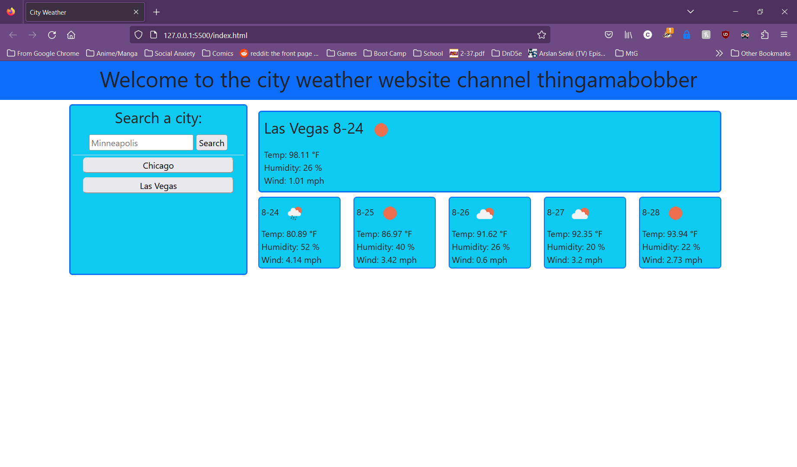

# Weather App

## User Story
AS A traveler
I WANT to see the weather outlook for multiple cities
SO THAT I can plan a trip accordingly

## Acceptance Criteria
GIVEN a weather dashboard with form inputs

WHEN I search for a city
THEN I am presented with current and future conditions for that city and that city is added to the search history

WHEN I view current weather conditions for that city
THEN I am presented with the city name, the date, an icon representation of weather conditions, the temperature, the humidity, and the the wind speed

WHEN I view future weather conditions for that city
THEN I am presented with a 5-day forecast that displays the date, an icon representation of weather conditions, the temperature, the wind speed, and the 
humidity

WHEN I click on a city in the search history
THEN I am again presented with current and future conditions for that city

## Description
A weather app using the open weather map API and Bootstrap as my CSS framework. This one took me a good minute to figure out, but it will show the temperature, humidity, and the wind of the earliest the API allows and the next 5 days, along with the date of each card and a corresponding icon to show the weather for that day. The user can also search other cities and the information provided will change accordingly, and will even provide a search history.

## Screenshot and Link

https://achurale.github.io/Weather-App/
